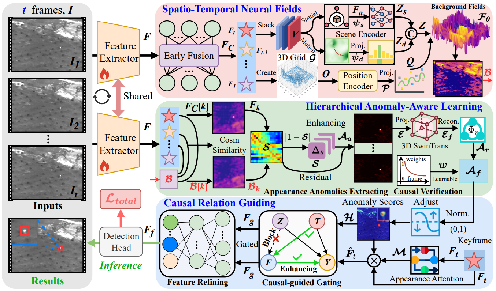
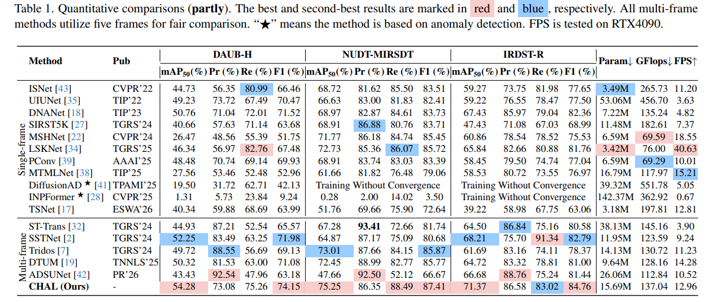

# CHAL
**[CVPR 26]CHAL: Causal-guided Hierarchical Anomaly-aware Learning for Moving Infrared Small Target Detection**



## Introduction
Infrared small target detection is one highly special category of object detection, faced with tiny target imaging size and cluttered backgrounds. Currently, almost all existing methods are target-centered, directly learning the target features from backgrounds. However, due to weak target signals, they are often difficult in effectively capturing stable features. Sometimes, they cannot even distinguish real targets from background confounders. To overcome these problems, from an opposite perspective, we propose the first Causal-guided Hierarchical Anomaly-aware Learning (CHAL) framework. Breaking through target-centered paradigm, it focuses on background learning, while the targets are handled as the anomalies in backgrounds. In detail, to fulfill the goal, a spatio-temporal neural field is designed to model the background evolution patterns from generative perspective. Meanwhile, a hierarchical anomaly-aware learning is proposed to decompose anomaly discovery. Furthermore, to block the spurious correlations often caused by background confounders, and enhance true target causality, a causal-guiding mechanism is designed. The experiments on three infrared datasets verify the effectiveness and superiority of our CHAL. Even in visible-light scenarios, it still possesses obvious adaptivity.

## Prerequisite
- scipy==1.10.1
- numpy==1.24.4
- matplotlib==3.7.5
- opencv_python==4.9.0.80
- torch==2.0.0+cu118
- torchvision==0.12.0
- pycocotools==2.0.7
- timm==0.9.16
- python==3.8.19
- Tested on Ubuntu 22.04.6, with CUDA 12.0, and 1x NVIDIA 4090(24 GB)

## Datasets (bounding box-based)
- Datasets are available at [DAUB-H](https://pan.baidu.com/s/18hq2ArrOSNoFh0Nq0u-ZlA) (code: xkps), [NUDT-MIRSDT](https://pan.baidu.com/s/1dYe8kKXs-yKILYo8U_Ipag?pwd=5sdr) and [IRDST-R](https://pan.baidu.com/s/1XRiP6nhWgzy8Cn0i-EssVA) (code: kt4d). DAUB-H is the hard version of DAUB, IRDST-R is the reconstruced version of IRDST.
- You need to reorganize these datasets in a format similar to the `coco_train_multi.txt` and `coco_val_multi.txt` files we provided (`.txt files` are used in training).  We provide the `.txt files` for NUDT-MIRSDT, DAUB-H and IRDST-R.
  For example:

```python
train_annotation_path = 'datasets/coco_train_multi.txt'
val_annotation_path = 'datasets/coco_val_multi.txt'
```
- The folder structure should look like this:

```
- coco_train_multi.txt
- coco_val_multi.txt
DAUB-H
├─instances_train2017.json
├─instances_test2017.json
├─coco_train_DAUBH.txt
├─coco_val_DAUBH.txt
├─images
│   ├─1
│   │   ├─0.bmp
│   │   ├─1.bmp
│   │   ├─2.bmp
│   │   ├─ ...
│   ├─2
│   │   ├─0.bmp
│   │   ├─1.bmp
│   │   ├─2.bmp
│   │   ├─ ...
│   ├─3
│   │   ├─ ...
```

## Usage of CHAL
### Train
- Note: Please change settings for different datasets, including the txt files, and image paths. Besides, you should load the pretrained model weights for further training.
```
CUDA_VISIBLE_DEVICES=0 python train.py
```
### Test

- Usually `best_model.pth` is not necessarily the best model. Please try different models for verification.

```python
"model_path": './logs/model.pth'
```

- You need to change the path of the `json file` of test sets. For example:

```python
cocoGt_path         = 'datasets/DAUB-H/instances_test2017.json'
dataset_img_path    = 'datasets/DAUB-H/'
```

```python
python test.py
```

### Visualization

- We support `video` and `single-frame image` prediction.

```python
mode = "predict"
```

```python
python predict.py
```

## Results
- For bounding box detection, we use COCO's evaluation metrics, mAP50, Precision, Recall and F1 score.



## Contact
IF any questions, please contact with Weiwei Duan via email: [dwwuestc@163.com]().


## citation
```
@InProceedings{Duan_2026_CVPR,
    author    = {Duan, Weiwei and Ji, Luping and Lei, Shipeng and Zhu, Sicheng and Huang, Jianghong and Ye, Mao},
    title     = {CHAL: Causal-guided Hierarchical Anomaly-aware Learning for Moving Infrared Small Target Detection},
    booktitle = {Proceedings of the IEEE/CVF Conference on Computer Vision and Pattern Recognition (CVPR)},
    month     = {June},
    year      = {2026},
    pages     = {21357-21366}
}
```
